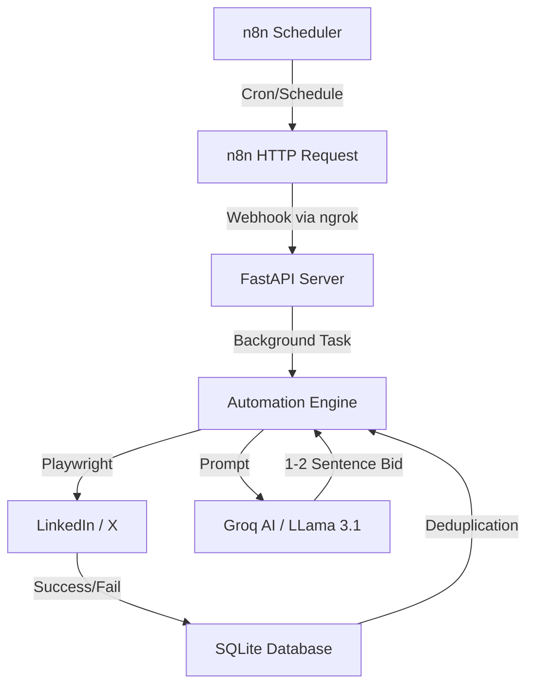

# Auto Bidding Bot - Automation Layer

An autonomous AI-driven bidding bot for LinkedIn and X (Twitter), built with Python, Playwright, FastAPI, and orchestrated via n8n.

## 🏗 Architecture Overview



## 🚀 Technical Workflow
1. **Trigger**: n8n kicks off a workflow every 2 hours during business hours.
2. **Handshake**: A secure POST request is sent via an **ngrok tunnel** to the local FastAPI server.
3. **Detection**: The bot launches a persistent Chromium instance, searches for the specified niche, and scans for new posts.
4. **Deduplication**: Each post URL is checked against a local **SQLite database** to ensure no duplicate bids are ever placed.
5. **Engagement**: To lower ban risk, the bot first **Likes** the post before engaging.
6. **AI Synthesis**: The post content is sent to **Groq (LLama 3.1)** to generate a highly relevant, concise, 2-sentence proposal.
7. **Execution**: The bot simulates human typing to post the bid and logs the successful interaction.

## Features
- **Multi-Platform**: Supports automated bidding on LinkedIn and X (Twitter).
- **AI-Powered**: Generates personalized, concise bid comments using Groq (LLama 3.1).
- **Stealth Features**:
    - **Like before Comment**: Automatically likes a post before replying to mimic human interest.
    - **Human Typing**: Simulates real keystroke delays.
    - **Randomized Behavior**: Includes random mouse movements and scrolling speeds.
- **Safety Controls**:
    - **Daily Limits**: Strictly capped at 15 bids for LinkedIn and 10 for X.
    - **Business Hours**: Only runs during customizable work hours (default 9 AM - 6 PM).
- **Orchestration**: Fully compatible with n8n for automated scheduling.

## Setup Instructions

1. **Install Dependencies**:
   ```bash
   pip install -r requirements.txt
   ```

2. **Install Playwright Browsers**:
   ```bash
   python -m playwright install chromium
   ```

3. **Configure Environment**:
   Rename `.env.example` to `.env` and add your AI API key and skills.

4. **Initial Login (Crucial)**:
   Run the server once and log in manually to save your session:
   ```bash
   python main.py
   ```
   Navigate to LinkedIn and X in the window that pops up and log in.

## n8n Integration

1. Install n8n.
2. Import the `auto_bid_workflow.json` file into n8n.
3. Set up **ngrok** to expose your local port 8000:
   ```bash
   ngrok http 8000
   ```
4. Update the HTTP Request nodes in n8n with your new ngrok URL.

## API Endpoints

### 1. Auto Bid (Background)
**Endpoint**: `POST /auto_bid`
**Query Parameters**:
- `niche`: The search term (e.g., "Python Developer")
- `platform`: `linkedin` or `x`

### 2. Manual Search
**Endpoint**: `GET /search?keyword=hiring&platform=linkedin`

---
*Disclaimer: Use responsibly. Automation that violates ToS can lead to account suspension.*
